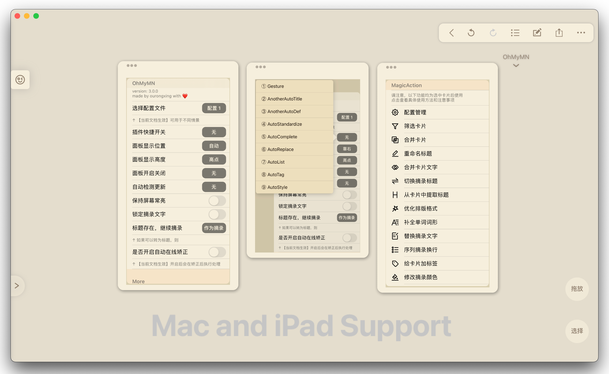

  
  <h3 align="center">OhMyMN</h3>
  
可能是最强大的 Marginnote3 插件

  
  
  
  
  

  <a href="https://github.com/ourongxing/ohmymn/releases">下载</a> ·
  <a href="https://github.com/ourongxing/ohmymn/issues">报告 Bug</a> ·
  <a href="https://github.com/ourongxing/ohmymn/issues">提出新需求</a>

# ohmymn

> ohmymn is the project name and OhMyMN is the addon name. Since OhMyMN is mainly for Chinese users and I am preparing for my exams, I have no plans to internationalize, but PR is welcome !

OhMyMN 的**设计理念**是通过高度自定义的设置来对摘录进行无感处理，让你觉得一切都是那么自然。OhMyMN 专注于**摘录，评论，标题，卡片**的相关处理，有且只有两种触发方式，一是摘录时自动触发，二是选中卡片（可多选）后点击按钮执行指定操作，避免了一切误触的可能性（我甚至提供了双击展开控制面板的选项）。更多信息请直接查看 [使用文档](https://busiyi.notion.site/OhMyMN-wiki-74ac16d09d17420391b8ffb0dd8cab01)。

## Development

ohmymn 作为插件面板，本身就是多个插件的集合，如果你认同我的设计理念，那么你可以为 ohmymn 开发插件，使得 ohmymn 更加强大。
更多信息请直接查看 [开发文档](https://busiyi.notion.site/busiyi/OhMyMN-wiki-74ac16d09d17420391b8ffb0dd8cab01#c5a601fcf71a4dda9bb05efdd5a1cf6f)。

当然你也可以另起炉灶，毕竟 ohmymn 已经踩过了大部分的坑。但是不建议使用 ohmymn 作为开发模板，ohmymn 并没有对此做任何优化，可能会出现冲突，不过我已经给大家准备了专门的 [MN插件开发模板](https://github.com/ourongxing/copysearch)，同时还有 [MN 插件开发指南](https://busiyi.notion.site/CopySearch-MN-856b316ec2854a70aa00e8bc1873892a)，帮助大家快速开发。

## Discussion
- [OhMyMN 飞书话题群](https://applink.feishu.cn/client/chat/chatter/add_by_link?link_token=f82q9d4d-fbe2-4487-95ec-86b4a5374750)
## License

该项目签署了MIT 授权许可，详情请参阅 [LICENSE](https://github.com/ourongxing/ohmymn/blob/main/LICENSE)

## Acknowledgements

* [mn-addon-api](https://github.com/aidenlx/mn-addon-api)  MN API 的类型声明文件。
* [obsidian-bridge](https://github.com/aidenlx/obsidian-bridge) 这是第一个使用 TS 开发 MN 插件的项目，使得我在使用 TS 重构 ohmymn 时非常顺利。
* [pangu.js](https://github.com/vinta/pangu.js) 为中英文之间添加空格，十分有效。
* [ECDICT](https://github.com/skywind3000/ECDICT) & [API](http://dict.e.opac.vip/dict.php) 为 AutoComplete 提供数据支持。

## Sponsor

这是一次很糟糕的开发体验，为了开发 ohmymn， 我装了黑苹果，买了 Mac 端的 MN，花费了大量的时间来踩坑和填坑（我还在考研复习）。如果本项目对您有所帮助，或者对您的开发有所启发，欢迎给小猫买点吃的，我也会尽可能为您解答疑问。

