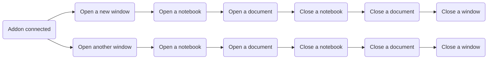

# 生命周期
所谓生命周期，也就是 MN 和插件在运行的各个阶段调用的特定方法。

## 实例方法
MN 的执行顺序

### sceneWillConnect()
创建新的 MN 窗口时触发，MN 支持多窗口，每次新建窗口都会触发这个方法。
### sceneDidDisconnect()
关闭 MN 窗口时触发。
### sceneWillResignActive()
MN 窗口失去焦点时触发。
### sceneDidBecomeActive()
MN 窗口获得焦点时触发。
### notebookWillOpen(topicid: string)
打开笔记本时触发。可以获取笔记本的 id。
### notebookWillClose(topicid: string)
关闭笔记本时触发。可以获取笔记本的 id。
### documentDidOpen(docmd5: string)
打开文档时触发。可以获取文档的 md5。
### documentWillClose(docmd5: string)
关闭文档时触发。可以获取文档的 md5。

## 静态方法
### addonDidConnect()
插件安装，启用，注意启动 MN 时也会触发。
### addonWillDisconnect()
插件卸载，停用时触发。